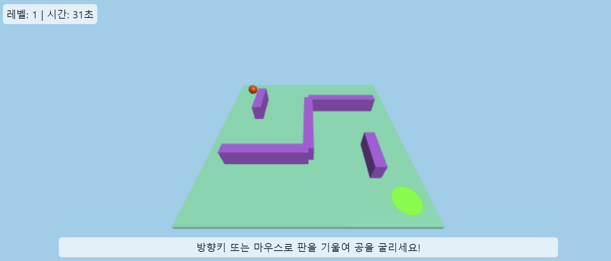

# 🚀 포트폴리오 웹사이트 한눈에 보기

안녕하세요! 아래는 저의 포트폴리오 웹사이트를 위에서 아래로 한눈에 살펴볼 수 있도록 정리한 소개 자료입니다. 발표 화면에 띄워도 보기 좋게, 이모티콘과 함께 핵심만 쉽고 간결하게 담았습니다.

---

## 👤 프로필 & 자기소개

![프로필 이미지]

- 👋 **GyuJin Cheon**
- "사용자에게 정말 필요한 기능을 고민하고 구현하는 개발자"
- 🎓 재능대학교 컴퓨터소프트웨어학과 재학 중
- 💻 **Favorite Stack:** JavaScript, Three.js, Node.js, MySQL
- 📧 cj542753303@gmail.com

---

## 🏗️ 주요 프로젝트

각 프로젝트는 카드 형태로, 상단에 분위기를 살린 그라데이션 컬러 바가 들어가 있습니다.

### 🏫 JEIU 캠퍼스 익스플로러 3D
- 기간: 2025.03.26 ~ 2025.04.16
- 역할: 프론트엔드 전체 구현, 백엔드 연동, UI 기획 및 디버깅
- 주요 기능: 3D 캠퍼스 시각화, 강의실 예약, 이벤트 정보 확인
- 사용 기술: Three.js, Express.js, MySQL 등
- 경험: 실무 감각 향상, 사용자 중심 UI 설계, 협업 경험

  
  
  

### 🖼️ 포트폴리오 속 3D 모델링
- 기간: 2025.05.14 ~ (진행 중)
- 역할: 기획부터 구현까지 전체 개발
- 주요 기능: 인터랙티브 3D 모델, 반응형 디자인
- 사용 기술: Three.js, Blender 등
- 경험: 3D와 웹의 통합, 성능 최적화, 다양한 환경 대응

### 🕹️ 3D 공 굴리기 미로 게임
- 기간: 2025.05.17 ~ 2025.05.20
- 역할: 전체 개발
- 주요 기능: 3D 미로, 물리 시뮬레이션, 실시간 인터랙션
- 사용 기술: Three.js, JavaScript 등
- 경험: 물리 엔진 활용, 즉각적 UI/UX, 게임 로직 설계

  

---

## 📚 요즘 배우는 것들

- 🛠️ **백엔드:** Django, FastAPI
- ☁️ **클라우드:** AWS EC2, S3, Lambda
- 🌀 **3D 웹 심화:** Blender 연동, 모델 최적화
- 🧑‍💻 **CS 기초:** 운영체제, 네트워크

---

## 📬 Contact Me

- 이름, 이메일, 메시지를 입력하면 바로 연락 가능! (폼으로 구현)
- 성공/실패 안내도 직관적으로 표시돼서 사용하기 편리합니다.
- **폼을 통해 메시지를 보내면, 내 Discord로 실시간 알림이 전송되어 바로 확인할 수 있습니다!**

  

---

## 🔗 Footer & 링크

- GitHub, 이메일 등 주요 링크를 아이콘과 함께 하단에 배치
- 전체적으로 밝고 현대적인 디자인, 각 섹션이 명확하게 구분되어 있어 정보 전달이 쉽습니다.

---

# 🛠️ 2. 앞으로 어떻게 만들어 나갈 건지 기획안 발표

## ❓ 문제정의 & 목표

- 저는 단순히 '멋진 포트폴리오'가 아니라, **실제 나의 성장과 커리어를 증명할 수 있는 공간**을 만들고자 합니다.
- 사용자(채용 담당자, 동료 개발자, 나 자신)가 **한눈에 저의 역량과 성장 과정, 문제 해결력**을 파악할 수 있도록 기획했습니다.
- 이 포트폴리오는 단기적으로는 취업/협업에 활용, 장기적으로는 저만의 개발 히스토리와 성장 기록장으로 발전시키는 것이 목표입니다.

## 🌱 나의 장기적 비전과의 연결

- 저는 앞으로도 **지속적으로 배우고, 다양한 기술과 경험을 쌓아가는 개발자**가 되고 싶습니다.
- 포트폴리오를 단순한 결과물 모음이 아니라, **기록과 공유, 그리고 새로운 도전을 위한 출발점**으로 삼으려 합니다.
- 나중에는 오픈소스 프로젝트, 기술 블로그, 커뮤니티 활동 등도 이 공간에 자연스럽게 연결할 계획입니다.

## 🔍 사례탐색 & 레퍼런스 분석

- 참고한 포트폴리오: [박OO님의 포트폴리오](https://www.rallit.com/hub/resumes/135463/%EB%B0%95%EC%98%88%EC%84%A0)
    - 실제로 잘 만든 포트폴리오를 분석하며, 저만의 색깔과 차별점을 고민했습니다.

### 💡 벤치마킹하며 느낀 점 & 내 포트폴리오에 적용할 아이디어

1. **Figma/Notion 설계 링크 or 기획 문서 첨부**
    - 단순히 결과만 보여주는 게 아니라, 실제로 어떻게 기획하고 설계했는지 과정을 보여주면 협업 능력과 기획력을 어필할 수 있습니다.
    - → 저도 주요 프로젝트마다 Figma, Notion, API 문서 등 설계 자료를 첨부할 예정입니다.

2. **성과 수치화**
    - 예: "사용자 30명 이상 테스트 진행", "DB 처리 속도 30% 개선" 등 **정량적 수치**를 추가하면 신뢰도가 높아집니다.
    - → 프로젝트별로 실제 수치, 개선 효과, 사용자 피드백 등을 적극적으로 정리할 계획입니다.

3. **프로젝트 1줄 요약 + 문제 해결 구조**
    - 각 프로젝트마다 "문제 → 접근 방식 → 해결 방법 → 결과" 흐름으로 간단하게 정리하면 읽는 사람이 이해하기 쉽습니다.
    - → 앞으로 모든 프로젝트 소개에 이 구조를 적용할 예정입니다.

4. **PDF 이력서 추가**
    - 포트폴리오 하단에 PDF 이력서를 첨부해, HR 담당자나 협업자가 바로 확인할 수 있도록 할 예정입니다.

---
