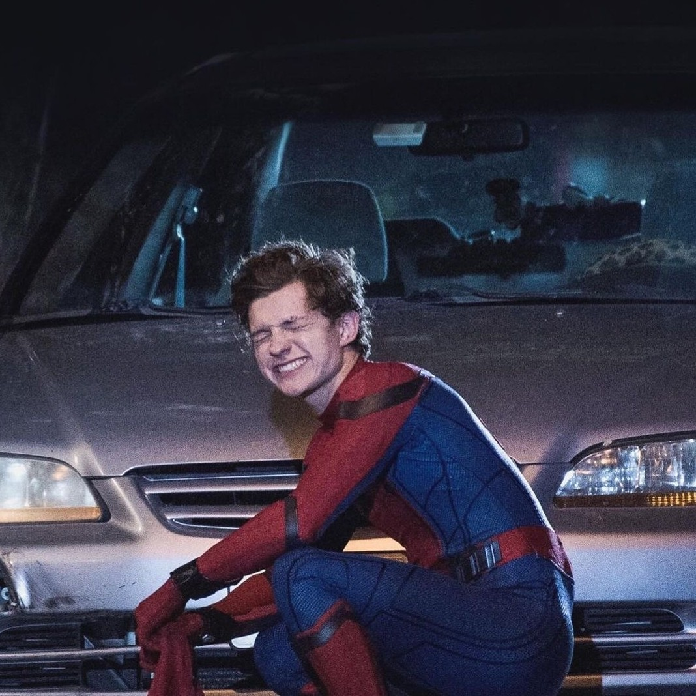
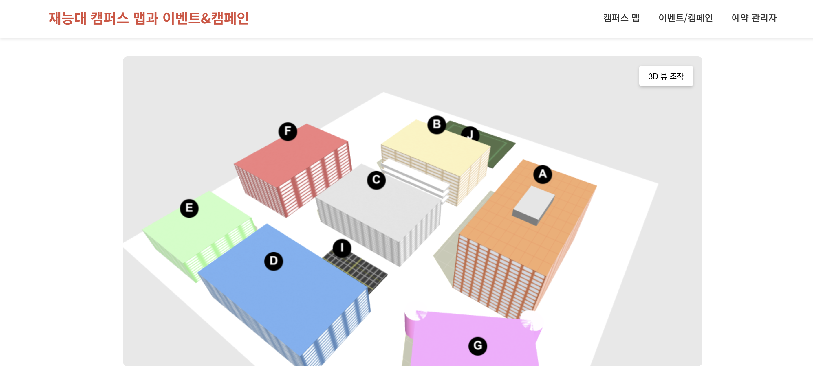
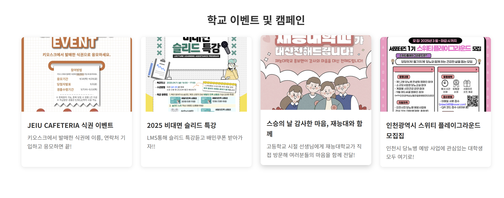
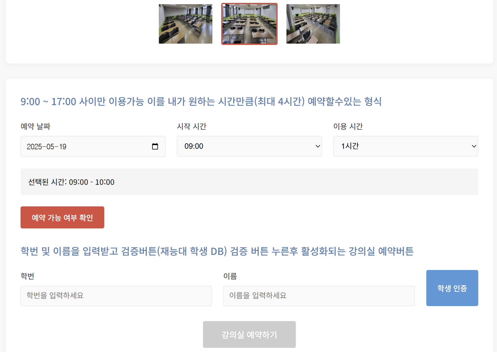
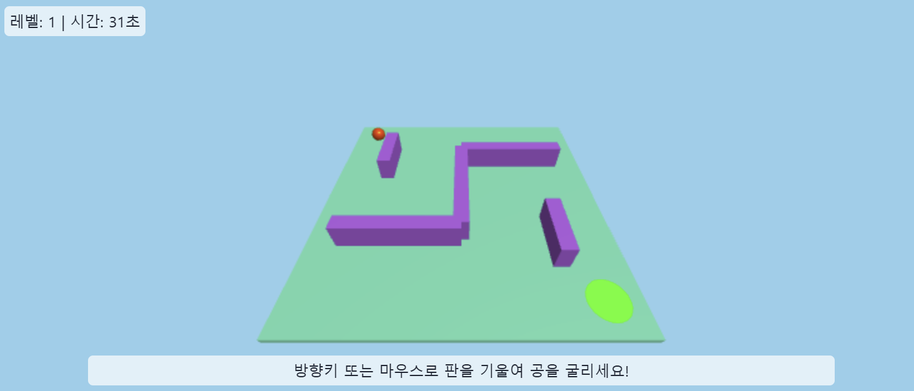
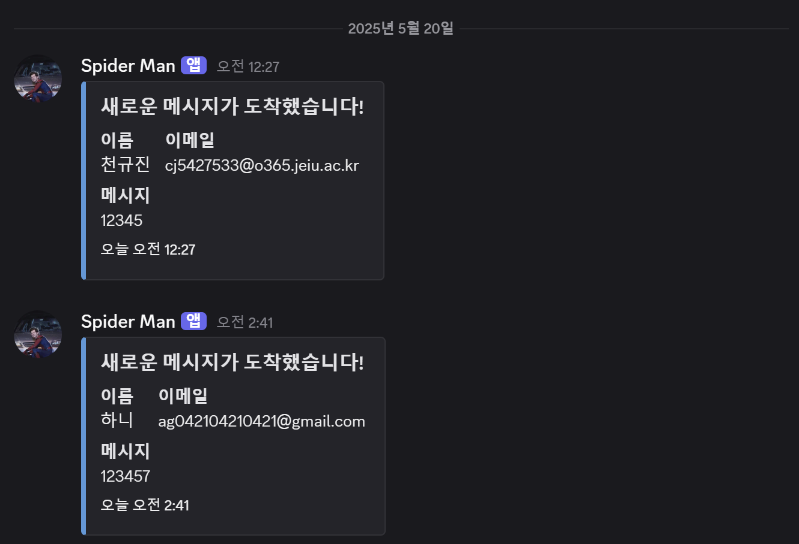

# 🚀 포트폴리오 웹사이트 한눈에 보기

안녕하세요! 웹 기술을 기반으로 모바일 앱 개발자로 성장하고자 하는 천규진입니다. 
아래는 저의 포트폴리오 웹사이트를 위에서 아래로 한눈에 살펴볼 수 있도록 정리한 소개 자료입니다. 
이모티콘과 함께 핵심만 쉽고 간결하게 담았습니다.

---

## 👤 프로필 & 자기소개

  

- 👋 **GyuJin Cheon**
- "사용자 중심의 UI/UX를 고민하며 웹과 모바일 모두에서 최적화된 경험을 제공하는 개발자"
- 🎓 재능대학교 컴퓨터소프트웨어학과 재학 중
- 💻 **Favorite Stack:** JavaScript/TypeScript, React Native, Three.js, Node.js, MySQL
- 📱 **관심 분야:** 크로스 플랫폼 개발, 인터랙티브 UI/UX, 모바일 성능 최적화
- 📧 cj542753303@gmail.com

---

## 🏗️ 주요 프로젝트

각 프로젝트는 카드 형태로, 상단에 분위기를 살린 그라데이션 컬러 바가 들어가 있습니다.

### 🏫 JEIU 캠퍼스 익스플로러 3D
- 기간: 2025.03.26 ~ 2025.04.16
- 역할: 프론트엔드 전체 구현, 백엔드 연동, UI 기획 및 디버깅
- 주요 기능: 3D 캠퍼스 시각화, 강의실 예약, 이벤트 정보 확인
- 사용 기술: Three.js, Express.js, MySQL 등
- 모바일 연계: 반응형 디자인으로 모바일 기기에서도 원활한 사용성 확보
- 경험: 실무 감각 향상, 사용자 중심 UI 설계, 협업 경험

  
  
  

### 🖼️ 포트폴리오 속 3D 모델링
- 기간: 2025.05.14 ~ (진행 중)
- 역할: 기획부터 구현까지 전체 개발
- 주요 기능: 인터랙티브 3D 모델, 반응형 디자인
- 사용 기술: Three.js, Blender 등
- 모바일 접근성: 터치 제스처 지원, 모바일 디바이스 성능 최적화
- 경험: 3D와 웹의 통합, 성능 최적화, 다양한 환경 대응

### 🕹️ 3D 공 굴리기 미로 게임
- 기간: 2025.05.17 ~ 2025.05.20
- 역할: 전체 개발
- 주요 기능: 3D 미로, 물리 시뮬레이션, 실시간 인터랙션
- 사용 기술: Three.js, JavaScript 등
- 모바일 지원: 터치 및 기기 기울기 센서 대응 인터페이스
- 경험: 물리 엔진 활용, 즉각적 UI/UX, 게임 로직 설계
- **코드 구조:**
  - **모듈화된 설계:** 게임 로직을 완전히 별도의 JS 파일로 분리하여 유지보수성 강화
  - **재사용성:** 다른 3D 기능을 추가할 때도 동일한 패턴 적용 가능한 구조 설계
  - **크로스 플랫폼:** 웹 기반이지만 모바일에서도 동일한 경험을 제공하는 반응형 설계

  

---

## 📚 요즘 배우는 것들

- 📱 **모바일 개발:** React Native, 코틀린, 안드로이드 스튜디오
- 🌉 **크로스 플랫폼:** 웹-모바일 연계 기술, 하이브리드 앱 개발 방법론
- 🛠️ **백엔드:** Firebase, Django, Java (모바일 백엔드 연동 중심)
- 🐳 **인프라:** Docker 컨테이너 기초, Cloudflare Workers, 모바일 CI/CD
- 🌀 **3D & UI/UX:** Three.js 활용법, Blender 연동, 모바일 UI 최적화
- 🧑‍💻 **CS 기초:** 운영체제, 네트워크, 모바일 앱 아키텍처

---

## 📬 Contact Me

- 이름, 이메일, 메시지를 입력하면 바로 연락 가능! (폼으로 구현)
- 성공/실패 안내도 직관적으로 표시돼서 사용하기 편리합니다.
- **폼을 통해 메시지를 보내면, 내 Discord로 실시간 알림이 전송되어 바로 확인할 수 있습니다!**
- **기술적 구현:**
  - **프론트엔드:** 폼 데이터를 JSON으로 변환하여 Cloudflare Worker API로 전송
  - **백엔드:** Cloudflare Worker가 데이터 검증 후 D1 데이터베이스에 저장 및 Discord 웹훅으로 알림 전송
  - **확장 계획:** 추후 모바일 앱에서도 동일한 API를 활용할 수 있도록 설계

  

---

## 🔗 Footer & 링크

- GitHub, 이메일 등 주요 링크를 아이콘과 함께 하단에 배치
- 전체적으로 밝고 현대적인 디자인, 각 섹션이 명확하게 구분되어 있어 정보 전달이 쉽습니다.

---

## 🏛️ 전체 코드 구조

- **모듈화된 설계:** 기능별로 파일을 분리하여 유지보수성과 확장성 강화
  - **index.html:** 전체 웹사이트 구조 및 UI 요소 정의
  - **js/maze-game.js:** 3D 미로 게임 로직을 완전히 분리하여 관리
  - **worker.js:** Cloudflare Workers를 통한 백엔드 기능 구현
- **이러한 구조의 장점:**
  - 코드 가독성 향상
  - 기능별 유지보수 용이
  - 새로운 3D 요소 추가 시 동일한 패턴으로 확장 가능
  - 백엔드와 프론트엔드의 명확한 분리
  - **모바일 개발로의 확장성:** 현재의 모듈화된 구조는 향후 React Native 등으로 모바일 앱 개발 시에도 유사한 패턴으로 적용 가능

---

## 🤝 개발 과정과 AI 협업

포트폴리오 개발 과정에서 AI 도구를 적극적으로 활용하되, 모든 핵심 결정과 구현 방향은 제가 직접 주도했습니다.

### 🔍 AI 활용 방식과 나의 역할

- **코드 구조 설계**: 초기 설계와 모듈화 전략은 제가 직접 결정했으며, AI는 리팩토링 방향에 대한 제안을 제공했습니다.
- **코드 재활용**: 미로 게임 구현 시, 이전 캠퍼스 프로젝트에서 개발했던 Three.js 관련 코드 중 필요한 부분을 선별하여 재활용했습니다. 특히 카메라 설정, 조명 처리, 그리고 기본적인 렌더링 루프는 제가 직접 판단하여 가져와 새로운 요구사항에 맞게 수정했습니다.
- **기술적 난관 해결**: 물리 엔진 구현과 충돌 감지 알고리즘에서 어려움을 겪었을 때, AI에게 방향성을 문의하고 여러 접근법 중 프로젝트에 가장 적합한 방법을 제가 직접 선택하여 구현했습니다.
- **디자인 결정**: 색상 조합, 애니메이션 효과, UI 레이아웃 등 모든 디자인 결정은 제가 직접 내렸으며, AI는 기술적 구현 방법에 대한 조언을 제공했습니다.

### 💡 AI와의 협업을 통한 학습

이러한 협업 과정에서 가장 큰 이점은 다양한 접근법을 빠르게 탐색하고 시도해볼 수 있다는 점이었습니다. 특히 미로 게임의 물리 시뮬레이션 부분에서 여러 구현 방식을 비교하고, 성능과 사용자 경험 측면에서 최적의 방법을 찾아내는 과정이 가장 큰 학습 포인트였습니다.

이 과정에서 AI는 도구로서 활용되었으며, 모든 최종 결정과 코드 품질에 대한 책임은 제가 가졌습니다. 이런 방식의 협업은 개발 속도를 높이면서도 직접적인 학습과 문제 해결 능력 향상에 큰 도움이 되었습니다.

---

# 🛠️ 2. 앞으로 어떻게 만들어 나갈 건지 기획안 발표

## ❓ 문제정의 & 목표

- 저는 단순히 '멋진 포트폴리오'가 아니라, **실제 나의 성장과 커리어를 증명할 수 있는 공간**을 만들고자 합니다.
- 사용자(채용 담당자, 동료 개발자, 나 자신)가 **한눈에 저의 역량과 성장 과정, 문제 해결력**을 파악할 수 있도록 기획했습니다.
- 이 포트폴리오는 단기적으로는 취업/협업에 활용, 
장기적으로는 **웹에서 모바일까지 아우르는 개발자**로서의 성장 기록장이 될 것입니다.

## 🌱 나의 장기적 비전과의 연결

- 저는 앞으로 **웹 기술을 기반으로 모바일 애플리케이션 개발 분야로 영역을 확장**하고 싶습니다.
- 현재 Three.js와 인터랙티브 웹 개발 경험은 향후 몰입감 있는 모바일 앱 UI/UX 설계에 큰 자산이 될 것입니다.
- 포트폴리오를 단순한 결과물 모음이 아니라, **웹과 모바일을 아우르는 개발자로 성장하는 여정을 보여주는 공간**으로 만들 계획입니다.
- 나중에는 크로스 플랫폼 프로젝트, React Native 앱 개발 사례, 모바일 최적화 기법 등을 추가할것입니다.

## 🔍 사례탐색 & 레퍼런스 분석

  - 참고한 포트폴리오: [랠릿 허브의 박OO님의 포트폴리오](https://www.rallit.com/hub/resumes/135463/%EB%B0%95%EC%98%88%EC%84%A0)
    - 실제로 잘 만든 포트폴리오를 분석하며, 저만의 색깔과 차별점을 고민했습니다.

### 💡 벤치마킹하며 제가 생각한 내 포트폴리오에 적용하면 좋아보이는 내용 4가지

1. **Figma/Notion 설계 링크 or 기획 문서 첨부**
    - 단순히 결과만 보여주는 게 아니라, 실제로 어떻게 기획하고 설계했는지 과정을 보여주면 협업 능력과 기획력을 어필할 수 있습니다.
    - → 저도 주요 프로젝트마다 Figma, Notion, API 문서 등 설계 자료를 첨부할 예정입니다.

2. **성과 수치화**
    - 예: "사용자 30명 이상 테스트 진행", "DB 처리 속도 30% 개선" 등 **정량적 수치**를 추가하면 신뢰도가 높아집니다.
    - → 프로젝트별로 실제 수치, 개선 효과, 사용자 피드백 등을 적극적으로 정리할 계획입니다.

3. **프로젝트 1줄 요약 + 문제 해결 구조**
    - 각 프로젝트마다 "문제 → 접근 방식 → 해결 방법 → 결과" 흐름으로 간단하게 정리하면 읽는 사람이 이해하기 쉽습니다.
    - → 앞으로 모든 프로젝트 소개에 이 구조를 적용할 예정입니다.

4. **PDF 이력서 추가**
    - 포트폴리오 하단에 PDF 이력서를 첨부해, HR 담당자나 협업자가 바로 확인할 수 있도록 할 예정입니다.

## 🧩 앞으로의 코드 개선 계획

- **크로스 플랫폼 설계:** 웹과 모바일에서 모두 최적화된 경험을 제공하는 디자인 패턴 적용
- **React Native 연계:** 웹 포트폴리오의 일부 기능을 React Native로 구현하여 모바일 앱 개발 역량 강화
- **성능 최적화:** 3D 모델 로딩 및 렌더링 최적화, 모바일 환경에서의 성능 개선
- **모바일 앱 프로토타입:** 포트폴리오 내용을 소개하는 간단한 모바일 앱 개발하여 실제 앱 스토어 배포 경험 쌓기
- **테스트 자동화:** 웹과 모바일 환경 모두에서 안정적으로 동작하는지 확인하는 테스트 코드 구현

---